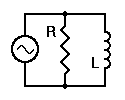

## Theory 

  

 

With an AC signal applied to it, the parallel RL circuit shown below offers significant impedance to the flow of current. This impedance will change with frequency, since that helps determine <em>XL</em>, but for any given frequency, it will not change over time.

As you would expect, Ohm's Law still applies, just as it has in other circuits. Voltage, being the same for all components, is our reference. Current, however, is the sum of the currents through <em>R</em> and <em>L</em>, keeping in mind that the coil opposes any change in current through itself, so its current lags behind its voltage by 90&deg;. Therefore, our basic equation for current must be:

$$I=\frac{V}{Z}=\frac{V}{R}=-j\frac{V}{X_L}$$

If we move the "<em>j</em>" to the denominator of its fraction, we must change its sign. This is also in keeping with the fact that <em>jωL = jXL</em>. As with the parallel RC circuit, we can divide the entire equation by <em>V</em> and solve for the complex impedance of this circuit. Our resulting initial equation is:

$$\frac{1}{Z}=\frac{1}{R}+\frac{1}{jX_L}$$

To calculate the total circuit impedance, we take the general equation:

$$Z=\frac{R*j(X_L-X_C)}{R+j(X_L-X_C)}$$

However, we only have R and L, so the XC factors drop out of the equation. This leaves us with:

$$Z=\frac{R*jX_L}{R+jX_L}$$

We complete the calculation by removing the "j" from the denominator:

$$Z = \frac{R \cdot jX_L}{R + jX_L} \cdot \frac{R - jX_L}{R - jX_L}$$

$$= \frac{(jR X_L)(R - jX_L)}{(R + jX_L)(R - jX_L)}$$

$$= \frac{jR^2 X_L - j^2 R X_L^2}{R^2 + X_L^2}$$

$$= \frac{R X_L^2 + jR^2 X_L}{R^2 + X_L^2}$$

 

This gives us an entirely real number in the denominator, which in turn makes the necessary computations possible and practical. Our parallel RL impedance is still a complex number, which can be written as:

$$Z = \frac{R X_L^2}{R^2 + X_L^2} + j \frac{R^2 X_L}{R^2 + X_L^2}$$

To verify this mathematical expression, let's try a practical example. Let <em>V</em> = 10 volts RMS, with <em>R</em> = 10&nbsp;&Omega; and <em>L</em> = 0.01 H and frequency = 100 Hz. Then: <em>XL</em> = 2&pi;&times;100&times;0.01 = 6.283&nbsp;&Omega;

$$I_R = \frac{V}{R} = \frac{10}{10} = 1\ \text{A}$$

$$I_L = \frac{V}{-jX_L} = \frac{10}{-j6.283} = j1.59\ \text{A}$$

$$I_T = \left( I_R^2 + I_L^2 \right)^{1/2} = \left( 1 + 2.53 \right)^{1/2} = 1.88\ \text{A}$$

$$Z = \frac{V}{I_T} = \frac{10}{1.88} = 5.32\ \Omega$$

The next step is to calculate <em>Z</em> using the equation we derived earlier, and compare that result with the result above. If we've done our math correctly, the results should match. For simplicity, we will first calculate the denominator (<strong>D</strong>) value and the two numerators (<strong>N1</strong> and <strong>N2</strong>). Then we can insert those values into the final equation.

<strong>D</strong> = R2 + XL2 = 102 + 6.2832 = 100 + 39.478 = <strong>139.478</strong>

<strong>N1</strong> = R &times; XL2 = 10 &times; 39.478 = <strong>394.78</strong>

<strong>N2</strong> = R2 &times; XL = 100 &times; 6.283 = <strong>628.3</strong>

Now we can insert these values into the full equation and solve for Z:

$$z = \frac{N1}{D} - j \frac{N2}{D}$$

$$= \frac{394.784175}{139.4784175} - j \frac{628.31853}{139.4784175}$$

$$= 2.83 - j\,4.50$$

$$Z = \left(2.83^2 + 4.50^2\right)^{1/2} = \left(28.2589\right)^{1/2}$$

$$= 5.32\ \Omega$$

We see that both sets of calculations produce precisely the same answer. This indicates that our method for calculating impedance without using (or knowing) the signal voltage is perfectly valid.

This can be verified using the simulator by creating the above mentioned parallel RL circuit and by measuring the current and voltage across the resistor and inductor. It should be consistent with the earlier findings.

### Applications
 

It has wide applications in.

1. Electronic filter topology
2. Analog circuits
3. Piezo electric shunt damping system

